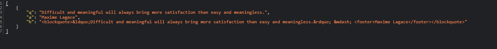

To start the server, simply open a terminal to this directory, install the requirements.txt, and type python server.py into the terminal.
To start the example client, open another terminal and type python example_client.py

server.py will listen on port 5555 for any incoming messages. When it receives a message, it will poll the zenquotes API and return the quote to the socket.
To receive data, keep the socket open and allow incoming json messages.

Example call:
socket.connect("tcp://localhost:5555")
sending_message = "Quote"
socket.send_string(sending_message)

Return format:

UML Diagram

